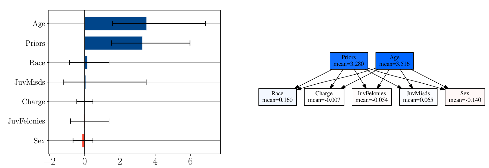
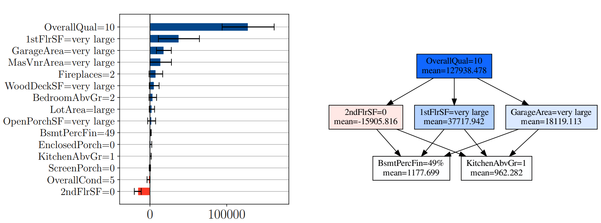

# Partial Order in Chaos

This repository implements the code of the paper
[Partial Order in Chaos: Consensus on Feature Attributions
in the Rashomon Set](https://arxiv.org/pdf/2110.13369.pdf).

## Explaining models in the Rashomon Set

----------------------------------------

The main idea is that,
given a ML task with finite data, there is no single best predictor
but rather an equivalence class of predictors with similar empirical performance,
also called a Rashomon Set 
$$\lbrace h\in \mathcal{H}: \text{error}(h) \leq \epsilon\rbrace.$$

Each of these models gives a different, but still valid perspective on the data.
Now, if you were to compute post-hoc explanations  (Permutation Importance, SHAP, Integrated Gradient, etc.), you would draw different (and even contradicting) conclusions from the diverse models in the Rashomon Set.

The contribution of this work is that we aggregate the post-hoc explanations of competing models by only highlighting the information on which **all good models agree**. The model consensus is visualised with a Hasse
Diagram, where an arrow points from feature $i$ to feature $j$ if and only if all models agree
that the $i$ is more important than $j$.
We present some concrete examples

## Permutation Importance on COMPAS

Here we compute the Global Feature Importance (GFI) on COMPAS using the Permutation Importance
method. That is, we shuffle the value of a feature in the data and compute the resulting decrease in importance. The larger the decrease, the most important the feature is to the model. We show the range of GFI between models in the Rashomon Set of Kernel Ridge
Regression fitted to predict COMPAS scores.

First of, looking at the bar charts, no model relies strongly on `Sex` and `Charge` so we could discard these features when fitting Kernel Ridge. Secondly, looking at the Hasse Diagram, we see that all models agree features
`Age` and `Priors` are more important than any other. Therefore, these two feature are the **most** important ones when predicting COMPAS scores with Kernel Ridge. We note that `Age` and `Priors` are incomparable since there is no directed path connecting them. This means that some good models rely more
on one then the other.

## Local Feature Attributions for House Price

In this experiment, we compute the Local Feature Attributions (LFA) of additive models fitted to predict house prices.
Typically, the LFA would be computed with techniques like SHAP or Integrated Gradient, but for additive models, both techniques end up yielding the same LFA. We can compute the LFA of one of the most expensive houses in the dataset to understand why is price is so much higher-than-average.

The Hasse diagram reveals that, when explaining the high price of this house, all models agree the **most** important feature is `OverallQual=10`. This suggests that the quality of the materials of the house might be a major factor in this dataset. Bellow `Overall=10` in the Hasse diagram, we have other features that are also important for this prediction, but to a lesser extend than `OverallQual=10`.

## Structure

----------------------------------------

The repository is structured as follows

- `experiments` All necessary Python scripts to reproduce the experiments of the paper.
- `tests` Unitests and visual tests to verify the base functionalies of the repo.
- `uxai` Main source code to compute the Rashomon Set of Linear/Additive models, Kernel Ridge Regression, and Random Forests. The following post-hoc  explanation methods are supported
  - `linear/additive` Build-in LFA and GFI since these models are interpretable by design.
  - `kernel` Integrated Gradient (LFA) and Permutation Importance (GFI).
  - `random_forests` TreeSHAP (LFA) and Mean Absolute TreeSHAP (GFI). Mean Absolute TreeSHAP consists of averaging the absolute value of local Shapley values and is the de-facto approach in the `SHAP` library.
